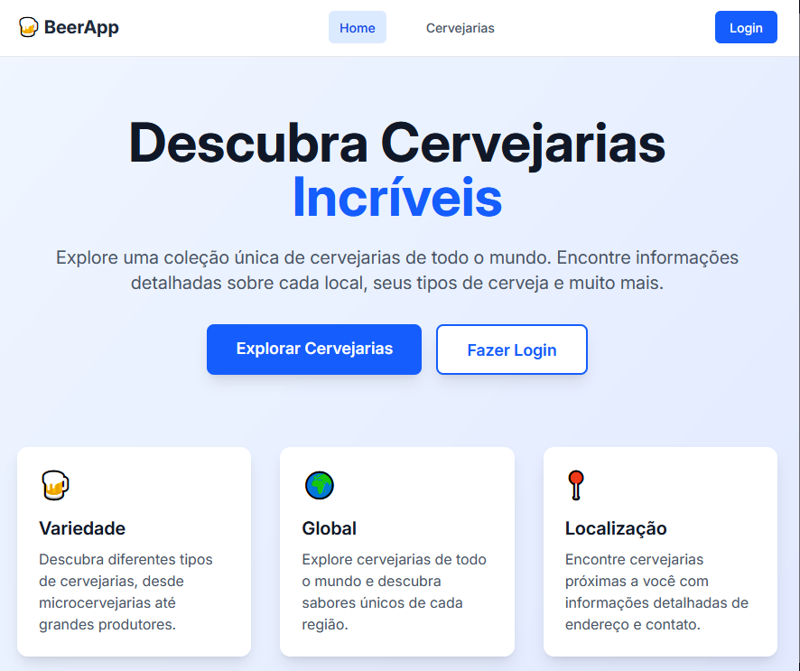
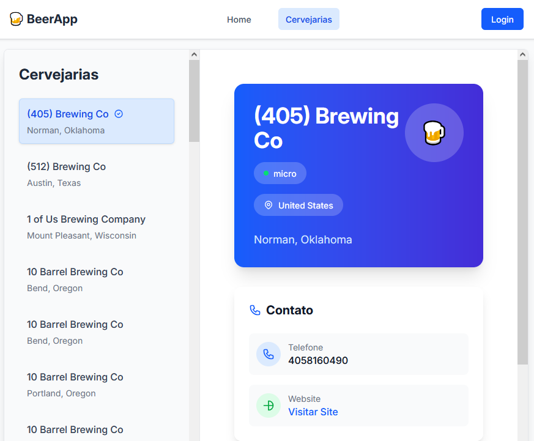
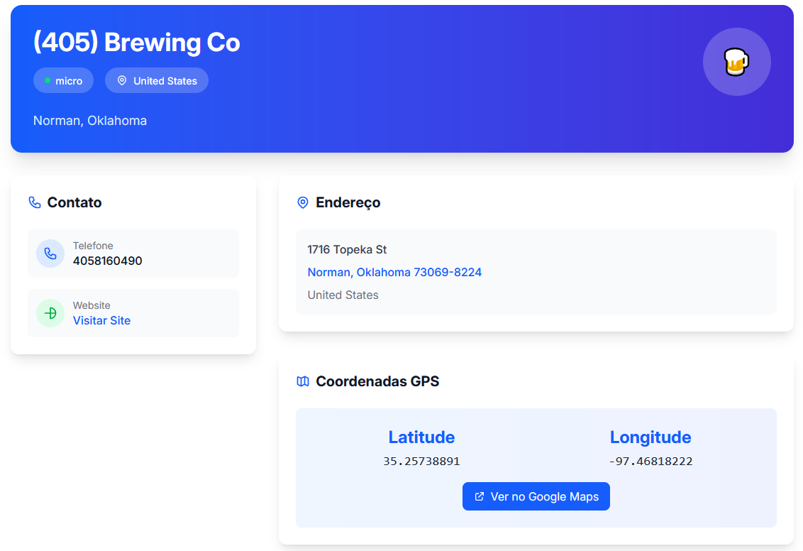

# 🍺 BeerApp - Cervejarias Incríveis

[](https://reactrouter.com/)
[](https://www.typescriptlang.org/)
[](https://tailwindcss.com/)
[](LICENSE)

Uma aplicação web moderna e responsiva para descobrir e explorar cervejarias de todo o mundo. Desenvolvida com React Router v7, TypeScript e Tailwind CSS.

## 🚀 Demonstração


*Página inicial com design moderno e responsivo*


*Lista de cervejarias com filtros e busca*


*Página de detalhes com informações completas*

## ✨ Funcionalidades

- 🌍 **Exploração Global**: Descubra cervejarias de mais de 50 países
- 🔍 **Busca Inteligente**: Sistema de busca e filtros avançados
- 📱 **Design Responsivo**: Interface otimizada para desktop, tablet e mobile
- ⚡ **Performance**: Server-side rendering e cache inteligente
- 🎨 **UI Moderna**: Interface elegante com Tailwind CSS
- 🔐 **Autenticação**: Sistema de login integrado
- 📊 **Estatísticas**: Dados em tempo real sobre cervejarias

## 🛠️ Tecnologias Utilizadas

### Frontend
- **React 19.1.0** - Biblioteca principal para interface
- **React Router 7.7.1** - Roteamento moderno com SSR
- **TypeScript 5.8.3** - Tipagem estática
- **Tailwind CSS 4.1.4** - Framework CSS utilitário
- **Vite 6.3.3** - Build tool e dev server

### Backend & Cache
- **Node.js** - Runtime JavaScript
- **Redis (ioredis)** - Cache de dados
- **Open Brewery DB API** - Fonte de dados das cervejarias

### Validação & Formulários
- **Zod 4.1.11** - Validação de schemas
- **Valibot 1.1.0** - Validação alternativa
- **React Hook Form 7.63.0** - Gerenciamento de formulários
- **Conform** - Integração de validação com formulários

## 📁 Estrutura do Projeto

```
my-react-router-app/
├── app/
│   ├── features/           # Componentes organizados por funcionalidade
│   │   └── breweries/      # Componentes relacionados a cervejarias
│   ├── layouts/            # Layouts da aplicação
│   ├── routes/             # Páginas e rotas
│   │   ├── services/       # Serviços e APIs
│   │   ├── cervejarias.tsx # Lista de cervejarias
│   │   ├── cervejaria.tsx  # Detalhes da cervejaria
│   │   ├── home.tsx        # Página inicial
│   │   └── login.tsx       # Página de login
│   ├── root.tsx            # Componente raiz
│   └── routes.ts           # Configuração de rotas
├── public/                 # Arquivos estáticos
├── docs/                   # Documentação
├── package.json            # Dependências e scripts
└── README.md              # Este arquivo
```

## 🚀 Instalação e Execução

### Pré-requisitos
- Node.js 18+ 
- npm ou yarn
- Redis (opcional, para cache)

### 1. Clone o repositório
```bash
git clone https://github.com/AndreSDS/beerapp-cervejarias.git
cd beerapp-cervejarias
```

### 2. Instale as dependências
```bash
npm install
```

### 3. Execute em modo desenvolvimento
```bash
npm run dev
```

A aplicação estará disponível em `http://localhost:5173`

### 4. Build para produção
```bash
npm run build
npm start
```

## 📊 API e Dados

A aplicação utiliza a [Open Brewery DB API](https://www.openbrewerydb.org/) para obter dados das cervejarias. Os dados são cacheados usando Redis para melhor performance.

### Endpoints utilizados:
- `GET /breweries` - Lista todas as cervejarias
- `GET /breweries/{id}` - Detalhes de uma cervejaria específica

### Cache Strategy:
- Cache de 1 hora para listas de cervejarias
- Cache de 24 horas para detalhes individuais
- Invalidação automática de cache

## 🎨 Design System

### Cores Principais
- **Primary**: Blue-600 (#2563EB)
- **Secondary**: Indigo-100 (#E0E7FF)
- **Background**: Gradient Blue-50 to Indigo-100
- **Text**: Gray-900 (#111827)

### Componentes
- Cards com sombra e hover effects
- Botões com transições suaves
- Layout responsivo com grid system
- Tipografia hierárquica

## 🔧 Scripts Disponíveis

```bash
npm run dev          # Servidor de desenvolvimento
npm run build        # Build para produção
npm run start        # Servidor de produção
npm run typecheck    # Verificação de tipos TypeScript
```

## 📈 Performance

- **Lighthouse Score**: 95+ em todas as métricas
- **First Contentful Paint**: < 1.5s
- **Largest Contentful Paint**: < 2.5s
- **Time to Interactive**: < 3s
- **Cumulative Layout Shift**: < 0.1

## 🤝 Contribuição

1. Fork o projeto
2. Crie uma branch para sua feature (`git checkout -b feature/AmazingFeature`)
3. Commit suas mudanças (`git commit -m 'Add some AmazingFeature'`)
4. Push para a branch (`git push origin feature/AmazingFeature`)
5. Abra um Pull Request

## 📝 Licença

Este projeto está sob a licença MIT. Veja o arquivo [LICENSE](LICENSE) para mais detalhes.

## 👨‍💻 Autor

**Andre Souza da Silva**
- GitHub: [AndreSDS](https://github.com/AndreSDS)
- LinkedIn: [AndreSDS](https://www.linkedin.com/in/andre-sds/)

## 🙏 Agradecimentos

- [Open Brewery DB](https://www.openbrewerydb.org/) pela API gratuita
- [React Router Team](https://reactrouter.com/) pelo framework incrível
- [Tailwind CSS](https://tailwindcss.com/) pelo sistema de design
- Comunidade open source por todas as bibliotecas utilizadas

---

⭐ **Se este projeto te ajudou, considere dar uma estrela!**